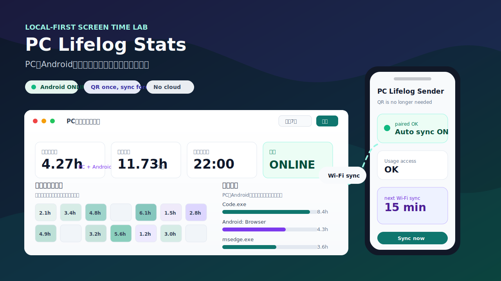
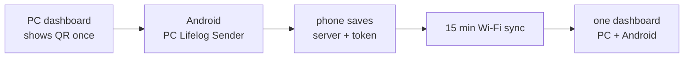

# PC Lifelog Stats

<p align="center">
  
</p>

<p align="center">
  
  
  
  
</p>

PCとAndroidのスクリーンタイムを、ひとつのローカル画面で見るためのライフログダッシュボードです。

ActivityWatchのPCログに、同梱のAndroid companion app **PC Lifelog Sender** を重ねます。スマホは初回だけPC画面のQRを読むだけ。あとはWi-Fi接続時に15分ごとに送られ、カレンダー、ランキング、時間帯ヒート、今日の合計に自然に混ざります。

## The Idea

PCの作業時間だけ見ても、生活の画面時間は半分しか見えません。

このアプリは「PCを何時間見たか」から一歩進んで、「今日、自分はどの画面とどう付き合っていたか」を見える形にします。責めるための監視ではなく、自分のリズムを取り戻すための観測所です。

## What You Get

| View | What it tells you |
| --- | --- |
| 今日の合計 | PC + Android の合算スクリーンタイム |
| Focus Lab | 集中度、切り替え回数、スマホ比率、夜の吸引力を読む |
| Goals | 画面時間、スマホ時間、Deep Work、Night Driftの目標を見る |
| Story | 選択期間を一文で読み、次の小さな実験を出す |
| Markdown Report | Story/Focus/Goals/Top Apps/Dailyを `.md` で出力 |
| 月間カレンダー | よく使った日ほど濃くなる。PC/Androidの比率も見える |
| アプリランキング | どのアプリが時間を持っていったか |
| ウィンドウランキング | 作業、ブラウザ、動画、調べ物の粒度まで見える |
| 時間帯ヒート | 何時台に画面へ吸い寄せられているか |
| Android連携パネル | ONLINE/OFFLINE、最終受信、今日のスマホ分を確認 |

## Android Sync Is Built In

普通のActivityWatchダッシュボードではなく、このプロジェクトの面白いところはここです。



- PC側でQRを表示
- Androidアプリで一度だけ読み取り
- 以後QR不要
- Wi-Fiなどの非従量課金ネットワークで自動送信
- 送れなかった分は端末内に残り、次に送れるタイミングでまとめて送信
- tokenや個人ログは `local_data/` に保存し、Gitには載せない

## Focus Lab

画面時間の量だけではなく、画面時間の質も見ます。

- `Focus Score`: その期間がどれだけ集中寄りだったか
- `Deep Work`: 25分以上続いたPC作業の塊
- `Switching`: アプリやデバイスを切り替えた回数
- `Android Pull`: 全体に占めるスマホ比率
- `Night Drift`: 21時以降に寄った画面時間
- `Score Breakdown`: 点数の加点・減点理由
- `Confidence`: 分析に使えたイベント量から見た信頼度

さらに、その日の形に応じた短い読み解きを出します。

## Goals Without Nagging

目標は通知で怒るためではなく、残り具合を見るためにあります。

デフォルトでは以下を表示します。

- screen time under 6h
- Android under 2h
- Deep Work over 60m
- Night Drift under 25%

`local_data/goals.json` を作ると、ローカルで自分用に上書きできます。`local_data/` はGit管理外です。

## Period Story

選択期間を、ただの合計ではなく短いストーリーにします。

- 一番濃い日
- 一番軽い記録日
- 前半/後半の増減
- ピーク時間
- 次の期間で試す小さな実験

ヘッダーの `Report` ボタンから、選択期間のMarkdownレポートをダウンロードできます。

## Quick Start

ActivityWatchを起動してから、このリポジトリを起動します。

```powershell
git clone https://github.com/WaRara-men/pc-lifelog-stats.git
cd pc-lifelog-stats
.\start_dashboard.bat
```

ブラウザで `http://127.0.0.1:8765` が開きます。

## Start Like An App

デスクトップにショートカットを増やしたくない場合は、スタートメニューにだけ登録できます。

```powershell
powershell -NoProfile -ExecutionPolicy Bypass -File .\install_start_menu_shortcut.ps1
```

登録後は、Windowsキーを押して `lifelog` または `PC` と検索すると **PC Lifelog Stats** が出ます。

## Pair Android

PC側の受信ポートをLAN内だけ許可します。

```powershell
powershell -NoProfile -ExecutionPolicy Bypass -File .\enable_android_sender_firewall.ps1
```

ダッシュボードを開き、`Android連携` の `接続QRを表示` を押します。QRには接続先とlocal tokenが入ります。

```json
{
  "name": "PC Lifelog Stats",
  "server": "http://<PCのLAN IP>:8766",
  "token": "<local token>",
  "version": 1,
  "once": true
}
```

Android側はこの情報を保存し、以後は `POST /api/android/events` にtoken付きで送信します。

Androidアプリ本体は `android-sender/` にあります。Android Studioで開いて `app` モジュールをビルドします。現時点では個人利用向けのdebug APKとして扱っています。

```text
android-sender/app/build/outputs/apk/debug/app-debug.apk
```

## Data Safety

このアプリはActivityWatchのローカルAPIを読み取るだけです。ActivityWatchのデータを書き換えません。

このリポジトリには、個人のActivityWatchログ、CSV、JSONL、DB、`.env`、秘密鍵、トークンを含めない方針です。`.gitignore` でもそれらを除外しています。

## Android Export Fallback

Android Senderを使わず、ActivityWatch AndroidのExport JSONを取り込むこともできます。

```powershell
powershell -NoProfile -ExecutionPolicy Bypass -File .\import_android_export.ps1 "C:\path\to\aw-buckets-export.json"
```

同じExportファイルを継続して使う場合は、自動取り込み対象として登録できます。

```powershell
powershell -NoProfile -ExecutionPolicy Bypass -File .\watch_android_export.ps1 "C:\path\to\aw-buckets-export.json"
```

取り込んだデータは `local_data/android_events.json` に保存されます。`local_data/` はGit管理外です。

## Requirements

- Windows 11
- Python 3.12+
- ActivityWatch desktop app
- ActivityWatch local API: `http://localhost:5600/api/0`
- Android companion app build: Android Studio or Gradle + Android SDK

## Roadmap

- カテゴリ分類
- 週/月レポート
- CSVエクスポート
- より細かいAndroidアプリ分析
- 使いすぎアラート

## Status

Personal local-first project.
今は自分のPCとAndroidを軽くつなぎ、すぐ見えることを優先した版です。
